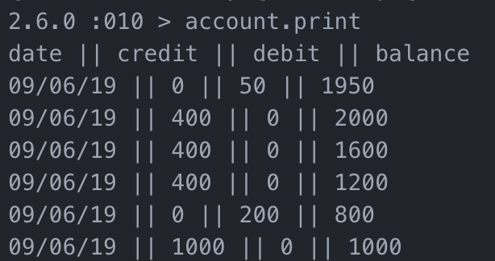

# Bank tech test

## Specification

### Requirements
You should be able to interact with your code via a REPL like IRB or the JavaScript console. (You don't need to implement a command line interface that takes input from STDIN.)
Deposits, withdrawal.
Account statement (date, amount, balance) printing.
Data can be kept in memory (it doesn't need to be stored to a database or anything).

#### Acceptance criteria

Given a client makes a deposit of 1000 on 10-01-2012 
And a deposit of 2000 on 13-01-2012 
And a withdrawal of 500 on 14-01-2012 
When she prints her bank statement 
Then she would see

date || credit || debit || balance 
14/01/2012 || || 500.00 || 2500.00 
13/01/2012 || 2000.00 || || 3000.00 
10/01/2012 || 1000.00 || || 1000.00

### User stories

As a client 
So that I can store my money safely 
I want to be able to deposit it in my account

As a client 
So that I can access my money 
I want to be able to withdraw my money

As a client 
So that I can keep track of my money 
I want to be able to print a statement which lists my account history
 
 

##### Using this application:
 
This application can be run through IRB.

$ irb

require './lib/account'

account = Account.new

##### An example of app in use below:
 
account.credit 1000 
account.debit 200 
account.credit 400 
account.credit 400 
account.credit 400 
account.debit 50

account.print

